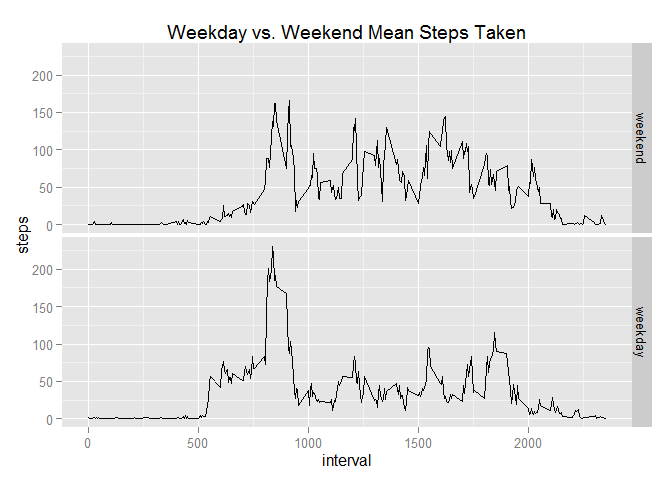

# Reproducible Research: Peer Assessment 1


## Loading and preprocessing the data

First we must prepare the workspace by clearing the workspace, loading the data, and loading
the appropriate libraries.

The workspace is cleared using the rm function.
The working directory must be set to the location of the "activity" dataset.
The knitr and ggplot2 libraries are loaded.


```r
rm(list = ls())
setwd("C:/Users/Sumeet/RepData_PeerAssessment1")
library(knitr)
library(ggplot2)
```

Set Global Options

```r
opts_chunk$set(fig.path='figure/')
opts_chunk$set(echo = TRUE)
```

### Load the data

Load the "activity" dataset. I have already unzipped the activity.zip file manually.  If you have yet to unzip it, you can do so manually or use the unzip() function.

```r
activity<-read.csv("activity.csv")
```

### Process/transform the data into a format suitable for analysis

#### Processing for Question 1: "What is the mean total number of steps taken per day?"

In order to get the total number of steps taken each day, we can split up the activity data set with the split function.  This will yield a list of 61 (one for each day) vectors, each containing the number of steps taken in each 5 minute interval.

```r
stepsByDate<-split(activity$steps,activity$date)
```

We can then remove NA values and apply the sum function to each value in the list of stepsByDate to get a vector of named integers, where each integer is the sum of all the steps taken on a particular date, which is the name. We then convert this into a data frame and rename the column with the sum of all steps to "steps."

```r
stepsByDate<-sapply(stepsByDate, sum, na.rm = TRUE)
stepsByDate<-as.data.frame(stepsByDate)

names(stepsByDate)<-"steps"  ##Rename the column from activity.steps to just steps
```

#### Processing for Question 2: "What is the average daily activity pattern?"

We split up the activity dataset into the sum of the steps taken per 5 minute interval similar to how we split it up into the sum of steps taken per day.  Once again, we remove NA values, convert it into a data frame, and rename the column containing the sum of steps to "steps."

```r
stepsByInterval<-split(activity$steps,activity$interval)
stepsByInterval<-sapply(stepsByInterval, mean, na.rm = TRUE)
stepsByInterval<-as.data.frame(stepsByInterval)
names(stepsByInterval)<- "steps"
```

## What is mean total number of steps taken per day?

### Make a histogram of the total number of steps taken each day

Because we have the data in the appropriate format thanks to our preprocessing, creating this histogram is a simple function of simply calling on the hist function from the base plotting system. 
NOTE: The number of breaks has been set to 20 to provide what I believe to be the most helpful plot. However, this can be adjusted if one would like larger or smaller buckets.

```r
hist(stepsByDate$steps, 
     breaks = 20,
     col = "red", 
     main = paste("Histogram of", "Steps Taken in a Day"),
     xlab = "Steps Taken in a Day")
```

 

The histogram shows the frequency with which certain ranges of steps are taken in a day.  We can see that the most frequent amounts of steps taken daily are 0-1000 and 10000-11000 each with 10 days that fall into those ranges.

### Calculate and report the mean and median total number of steps taken per day

Because we have the stepsByDate dataset which contains the total number of steps taken each day, all we need to do to get the mean and median total number of steps taken each day is to use the mean and median functions on the "steps" column of the data frame.

```r
mean(stepsByDate$steps)
```

```
## [1] 9354.23
```

```r
median(stepsByDate$steps)
```

```
## [1] 10395
```

The mean total number of steps taken per day is **9354.23**.
The median total number of steps taken per day is **10395**.

## What is the average daily activity pattern?

### Make a time series plot of the 5-minute interval (x-axis) and the average number of steps taken, averaged across all days (y-axis).

We have the data frame stepsByInterval from our pre-processing that contains the mean number of steps taken during each of the 5 minute intervals across all 61 days. We can use the base plotting system to create a time series plot of the mean number of steps taken during each 5-minute interval.

```r
plot(stepsByInterval$steps, 
     type = "l",
     main = "Mean Steps Taken in Each 5-Minute Interval",
     xlab = "5-Minute Interval",
     ylab = "Average Number of Steps Taken")
```

 

The plot shows how there is, on average, very few steps taken before the 50th interval, a peak of activity from about the 100th to the 110th interval, and then a medium amount of steps until the 250th interval, after which activity decreases to very low amounts again.

### Which 5-minute interval, on average across all the days in the dataset, contains the maximum number of steps?

To figure out which interval has the highest average number of steps taken across all days, we use the which.max function to find the index of the greatest value in the stepsByInterval data frame.

```r
rowNames<-row.names(stepsByInterval)
which.max(stepsByInterval$steps)
```

```
## [1] 104
```

```r
max(stepsByInterval$steps)
```

```
## [1] 206.1698
```

The maximum average number of steps per interval, **206.1698** occurs in the **104th** interval which in the dataset is **835** (which is to be read as **8:35 military time**).

## Imputing missing values

### Calculate and report the total number of missing values in the dataset (i.e. the total number of rows with NAs).

To calculate the number of missing values in the activity dataset, we can use the is.na function to generate a binary TRUE/FALSE vector, isNA, that will have a TRUE at every position where the activity dataset has a missing value in the steps column (the other columns are date and interval, and will never have NA values).  By checking the length of the subset of the isNA vector where the value == TRUE, we get the number of missing values in the dataset.

```r
isNA<-is.na(activity$steps)
length(subset(isNA, isNA == TRUE))
```

```
## [1] 2304
```

The number of missing values in the dataset is **2304**.

### Devise a strategy for filling in all of the missing values in the dataset. The strategy does not need to be sophisticated. For example, you could use the mean/median for that day, or the mean for that 5-minute interval, etc.

I decided to replace the NA step values with he mean step value for that 5 minute interval.

### Create a new dataset that is equal to the original dataset but with the missing data filled in.

Create a dataset identical to the original. This is the data frame that will have filled in NA values.

```r
modActivity<-activity
```

Create a vector of equal length of the interval means by repeating the list of interval means
as many times as there are unique days in the dataset.

```r
meanInterval<-rep(stepsByInterval$steps, length(unique(activity$date)))
```

Fill in the NA values in the new dataset by using the isNA vector created earlier(to detect NA values in the dataset) and replacing them with the appropriate mean from the meanInterval vector.

```r
for(i in 1:length(activity$steps)){
        if(isNA[i]==TRUE){
                modActivity[i,1]=meanInterval[i]
        }
}
```

### Make a histogram of the total number of steps taken each day and Calculate and report the mean and median total number of steps taken per day. Do these values differ from the estimates from the first part of the assignment? What is the impact of imputing missing data on the estimates of the total daily number of steps?

We use the same method as we did with the original data to create a histogram of the number of steps taken in a day, except this time we use the new data, modActivity.

```r
modStepsByDate<-split(modActivity$steps,modActivity$date)
modStepsByDate<-sapply(modStepsByDate, sum, na.rm = TRUE)
modStepsByDate<-as.data.frame(modStepsByDate)
names(modStepsByDate)<-"steps"

hist(modStepsByDate$steps,
     breaks = 20,
     col = "red", 
     main = paste("Histogram of", "Steps Taken in a Day (NA values imputed)"),
     xlab = "Steps Taken in a Day")
```

 

As can be seen in the histogram, the impact of imputing the missing values is quite noticeable. Before imputing the NA values, there were 2 peaks, one at 0-1000 and another at 10000-11000, each with 10 occurrences.  However, after imputing, the peak at 0-1000 has disappeared, and there is just one peak at 10000-11000 steps that is far larger than any other frequency (over 15 occurrences, with the next highest being 6 occurrences).

The mean and median values are calculated.

```r
mean(modStepsByDate$steps)
```

```
## [1] 10766.19
```

```r
median(modStepsByDate$steps)
```

```
## [1] 10766.19
```

The mean total number of steps taken per day with imputed values is **10766.19**
The median total number of steps taken per day with imputed values is **10766.19**

Earlier, when we simply removed NA values, the data became skewed as NA was interpreted like a 0 value.  By imputing these values with the mean step value for that interval, we no longer skew the data towards 0.  The initial mean and median we calculated were **9354.23** and **10395** respectively.  The new mean and median are not only slightly higher (no longer skewed towards 0), but they are also the same as one another (**10766.19**).

## Are there differences in activity patterns between weekdays and weekends?

### Create a new factor variable in the dataset with two levels -- "weekday" and "weekend" indicating whether a given date is a weekday or weekend day.

Create a dataset identical to the set with imputed values. This data frame will have the new factor variable added to it.

```r
modActivity2<-modActivity
```

Create a new column in the data set.  Copy over the dates from the date column and then use the weekdays function to convert the dates into days of the week.

```r
modActivity2$day.type<-as.POSIXct(strptime(modActivity2$date, "%Y-%m-%d"))
modActivity2$day.type<-weekdays(modActivity2$day.type)
```

Replace the specific days of the week with either "weekday" or "weekend."

```r
for(i in 1:length(modActivity2$date)){
        if(modActivity2$day.type[i] == "Saturday" | modActivity2$day.type[i] == "Sunday"){
                modActivity2$day.type[i] = "weekend"
        }
        else{
                modActivity2$day.type[i] = "weekday"
        }
}
```

Create separate datasets of weekend and weekday activity.

```r
wkndActivity<- subset(modActivity2, modActivity2$day.type == "weekend")
wkdyActivity<- subset(modActivity2, modActivity2$day.type == "weekday")
```

Get the average steps taken per interval of both the weekend and weekday activity datasets the same way that we got the average steps per interval across all days on the original activity dataset.

```r
wkndStepsByInterval<-split(wkndActivity$steps,wkndActivity$interval)
wkndStepsByInterval<-sapply(wkndStepsByInterval, mean, na.rm = TRUE)
wkndStepsByInterval<-as.data.frame(wkndStepsByInterval)
names(wkndStepsByInterval)<- "steps"
wkndStepsByInterval$day.type <- "weekend"
wkndStepsByInterval$interval <- row.names(wkndStepsByInterval)

wkdyStepsByInterval<-split(wkdyActivity$steps,wkdyActivity$interval)
wkdyStepsByInterval<-sapply(wkdyStepsByInterval, mean, na.rm = TRUE)
wkdyStepsByInterval<-as.data.frame(wkdyStepsByInterval)
names(wkdyStepsByInterval)<- "steps"
wkdyStepsByInterval$day.type<- "weekday"
wkdyStepsByInterval$interval <- row.names(wkdyStepsByInterval)
```

Combine the datasets into one easily usable by the ggplot2 package and decare the different facets of the data

```r
compareActivity<-rbind(wkndStepsByInterval, wkdyStepsByInterval)
compareActivity$day.type <- factor(compareActivity$day.type,levels=c("weekend", "weekday"),
                      labels=c("weekend", "weekday"))
```

Plot the data sets as time series using the ggplot2 plotting system.

```r
qplot(as.numeric(row.names(compareActivity)), compareActivity$steps,data = compareActivity, facets = day.type~. , geom = "line", xlab = "Interval", ylab = "Mean Steps Taken", main = "Comparison of Mean Steps per Interval: Weekends vs. Weekdays")
```

 

The plot shows us that there is on average much fewer steps taken on weekends, and what steps are taken are confined to a few intervals soon after midnight, while weekday activity is much greater and spread throughout the day.


